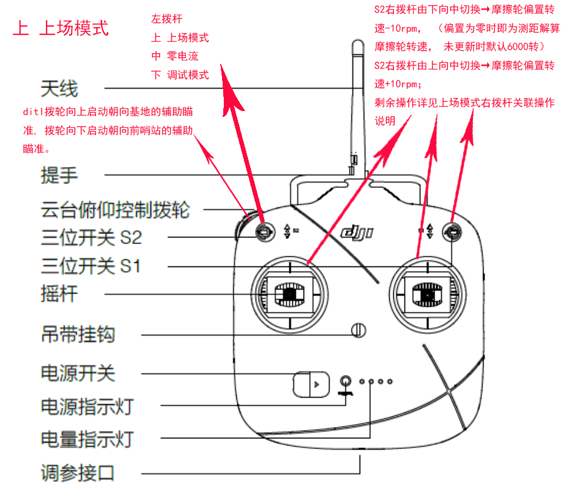

## OLED显示说明

- PT：当前发射架pitch角度
- FT：当前摩擦轮转速目标值
- YL：当前解算后发射架yaw偏角
- DS：测距仪返回值

## 上场说明

### 备场准备操作

- 调试模式检查各电机运动正常
- 检查测距仪返回值正常(若始终为零先用手挡在前方20cm处， 若更新解决， 若不更新需关开电池)
- 将手机连接摄像头确认正常工作
- 检查各飞镖供电及颜色及是否处于比赛模式
- 将6020减速齿的金线对齐
- 将摩擦轮转速拉到7800转看5m处的红点是否是圈， 若是， 考虑更换摩擦轮

### 发射准备操作

1. 飞镖架上电校准输弹机上限
2. 将飞镖架搬至飞镖发射站
3. 飞镖架对准发射站左下角
4. 打开磁吸底座
5. 连接发射站裁判系统主控
6. 将发射站滑台推回发射站主体内
7. 使用零电流模式将红点瞄准待击打目标中心
8. 使用测距值校准摆放位置是否与上次一致然后打手势
9. 调整到上场模式， 更新测距解算摩擦轮转速
10. 根据情况调整yaw偏置
11. 根据情况调整转速偏置
12. 使用大于60fps录制落点视频用于校射

## 操作说明

### S1左拨杆拨上(1) 为上场模式， 

#### 摩擦轮转速控制

- ch0右摇杆右方向拨到底 + S2右拨杆由任意方向向中切换→更新测距解算摩擦轮转速；

- S2右拨杆由下向中切换→摩擦轮偏置转速-10rpm， （偏置为零时即为测距解算摩擦轮转速， 未更新时默认6000转）
- S2右拨杆由上向中切换→摩擦轮偏置转速+10rpm； 
- ch3左摇杆下方向拨到底 + S2右拨杆由任意方向向中切换→摩擦轮转速偏置归零；

#### yaw轴控制

- ch2左摇杆左右方向拨到底 + S2右拨杆由任意方向向中切换→对应方向yaw角度+-0.05°(解算后发射架角度)；  
- ditl拨轮向上启动朝向基地的辅助瞄准(未完成标定), 拨轮向下启动朝向前哨站的辅助瞄准(该操作无法使用)。

#### 输弹机控制

- ch3左摇杆上方向拨到底 + S2右拨杆由任意方向向中切换→输弹机暂停(再操作一遍可以继续)；

### S1左拨杆拨中(3)为调试模式， 

- ch2左摇杆左右控制发射架yaw， 
- ch1右摇杆上下控制输弹机装填； 
- S2右拨杆拨中摩擦轮零电流； 
- S2右拨杆拨上摩擦轮低速旋转用于调试输弹机， 此时ditl拨轮向上摩擦轮正转可以弹出飞镖，向下摩擦轮反转可以装填飞镖； 
- S2右拨杆拨下摩擦轮高速旋转用于发射飞镖调试， 此时ditl拨轮向上摩擦轮转速升高， 反之降低。

### S1左拨杆拨下(2)为零电流模式，

 即所有电机都不会有驱动电流， 任意电机的角度可以被随意拨动。
