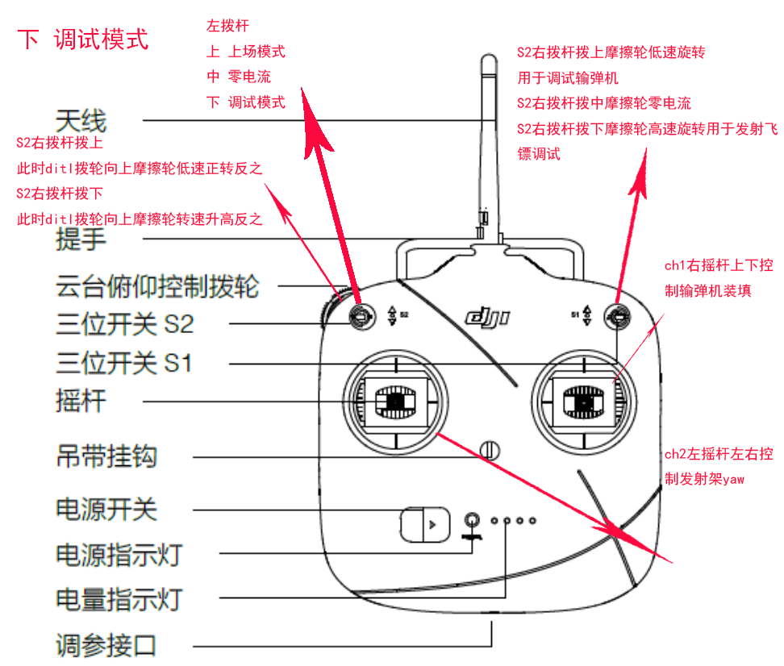

S1左拨杆拨上(1) 为上场模式， 上场模式下S2右拨杆由下向中切换→摩擦轮转速-10rpm， S2右拨杆由上向中切换→摩擦轮转速+10rpm； S2右拨杆由任意方向向中切换+ch2左摇杆左右方向拨到底→对应方向yaw角度+-0.05°(解算后发射架角度)。ditl拨轮向上启动朝向基地的辅助瞄准(未完成标定), 拨轮向下启动朝向前哨站的辅助瞄准。

S1左拨杆拨中(3)为零电流模式， 即所有电机都不会有驱动电流， 任意电机的角度可以被随意拨动。

S1左拨杆拨下(2)为调试模式， ch2左摇杆左右控制发射架yaw， ch1右摇杆上下控制输弹机装填； S2右拨杆拨中摩擦轮零电流； S2右拨杆拨上摩擦轮低速旋转用于调试输弹机， 此时ditl拨轮向上摩擦轮正转可以射出飞镖，向下摩擦轮反转可以装填飞镖； S2右拨杆拨下摩擦轮高速旋转用于发射飞镖调试， 此时ditl拨轮向上摩擦轮转速升高， 反之降低。