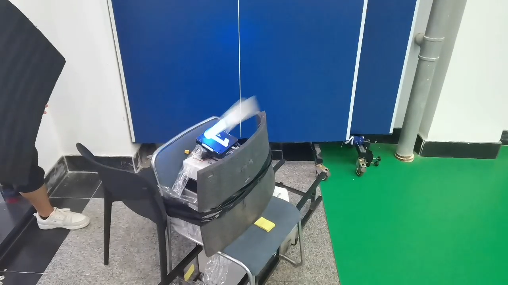
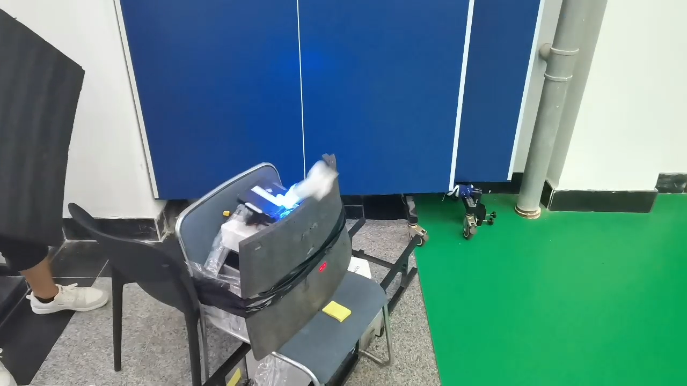
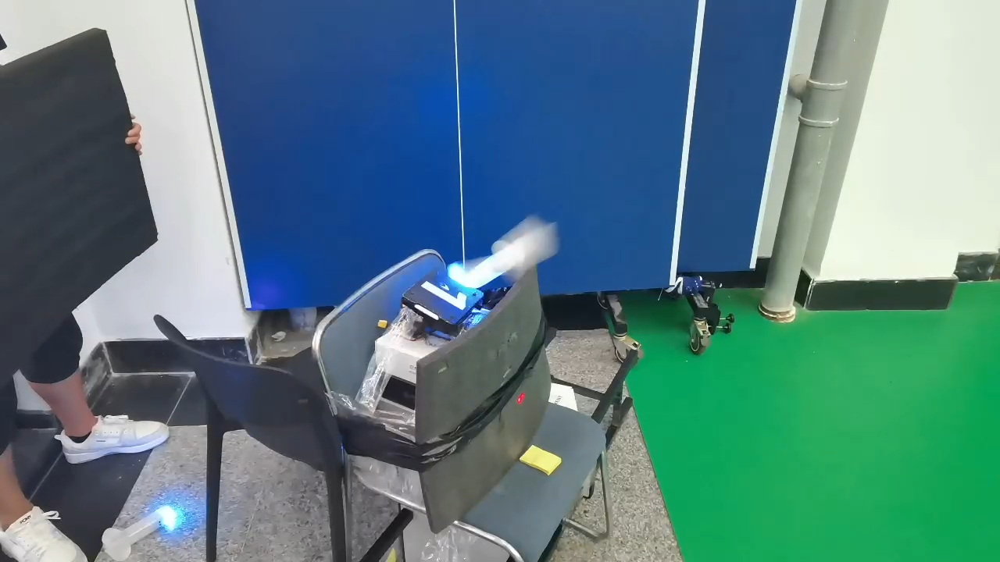
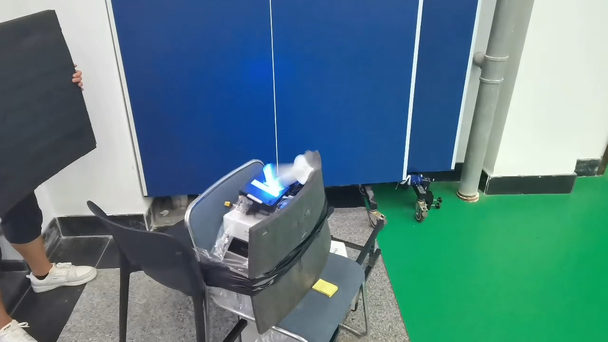
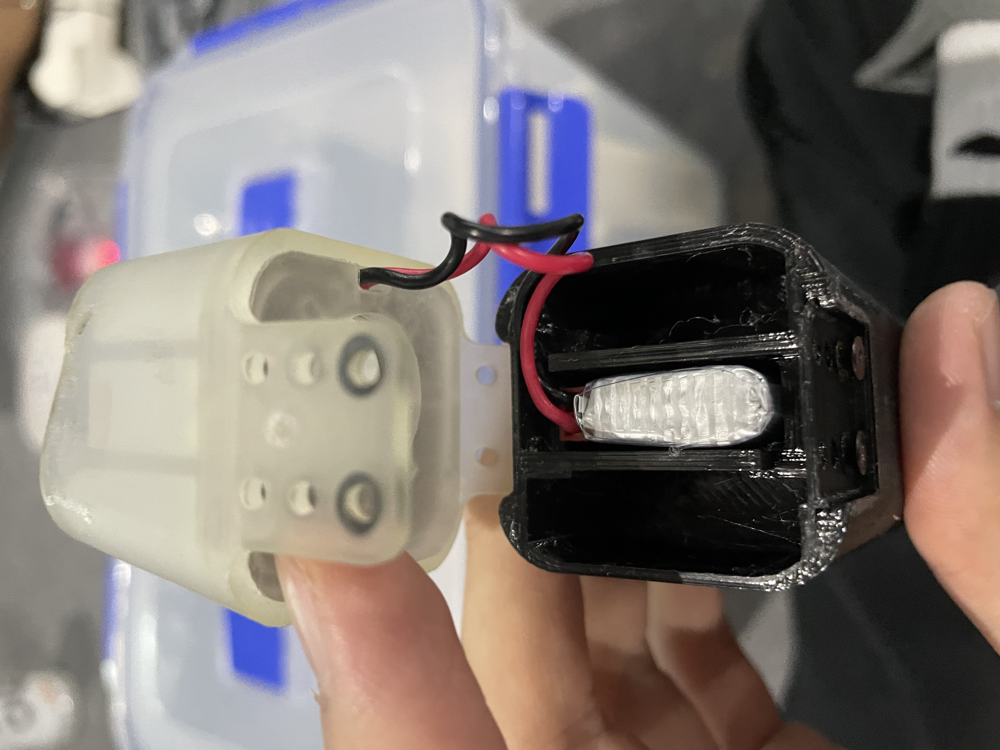

# 飞镖系统测试寄录

## 2023-5-2

### 测试前的修改内容

- 增加额外的pitch和roll方向的限位导轮
- 重新挑选振动数据更好的摩擦轮
- 增加磁吸底座
- 消除yaw齿轮齿隙
- 更改pitch铝方装配方式减小装配间隙
- 拆除摩擦轮双端固定轴承

### 测试记录

在经过对指定单一飞镖进行连续发射10次后记录落点数据

飞镖发射架在发射瞬间的响应使用240fps拍摄

<video src="updatelogs.assets/IMG_9056.MOV"></video>

飞镖在弹道中的姿态

<video src="updatelogs.assets/VID_20230502_144433.mp4"></video>

### 总结

- 后续增加镖体自旋速度稳定姿态（降低自旋速度， 因为高转会导致末段自旋动能不足姿态发散）
- 后续更换镖体材料
- 后续镖架增加纵向支撑型材

## 2023-5-7

### 测试前的修改内容

- 修改摩擦轮编码器速度低通滤波参数
- 飞镖修改为TPU材质的仿广城理飞镖
- 为兼容飞镖翼展略微修改镖架输弹碳管固定打印件和摩擦轮固定打印件
- 增高飞镖架把手

### 测试记录

在经过对指定单一飞镖进行连续发射10次后记录落点数据

飞镖架发射瞬间的红点抖动

<video src="updatelogs.assets/QQ视频20230509103541.mp4"></video>

飞镖在弹道中的姿态

<video src="updatelogs.assets/5FAC98E3E07F1F0252A80ECA0C74D347.MP4"></video>

### 总结

- 摩擦轮的装配方式对于抑制振动至关重要（每颗螺丝需使用同一扭矩拧紧）
- 飞镖弹道相较之前一致性大幅提高， 在弹道中几乎没有姿态发散， 尤其在yaw方向上
- 摩擦轮转速需大幅拉高才能达到和之前pla镖一致的射程7450→8000rpm
- 25m射程需约8700rpm（需要换用更硬更不易开胶的摩擦轮）
- 后续可进行飞镖在不同射程所需摩擦轮转速的标定
- 后续增加飞镖发射初速的观测方式用于修正弹道模型

## 2023-5-13

### 测试前的修改内容

- 更换一对全新摩擦轮（之前拉到9000的高转速动平衡失效）

### 测试记录

进行了一个镖的三连发的打， 图片显示了飞镖随摩擦轮温度上升射程下降

### 总结

- 温度补偿（后续测试发现温度对弹道影响不明显）

## 2023-5-17

### 测试前的修改内容

- 飞镖架增加四根pitch方向的加固铝方
- 摩擦轮垫块换用平整度更好的ABS-25gf打印
- 两枚重量完全一致的飞镖

### 测试记录

### 总结

- 重量一致对于弹道一致性格外重要， 但是飞镖头损坏导致落点有恒定偏差
- 摩擦轮温度越高散布圆越大
- 当前16m散布圆为一个pitch方向比小装甲板稍大， yaw方向半个小装甲板

## 2023-5-17

摩擦轮需要预热到31度， 过冷会导致射程大幅下降

即便重量一致还是会有小幅落点偏差， 偏差大约为3个装甲板且固定（TPU飞镖的一致性是真的很难保持）

主选飞镖：R0 R1 B0 （记得切换颜色）

10 转速大约对应落点半个小装甲板

打前哨站平均需要右偏0.05°

打基地平均需要右偏0.4°

## 2023-7-5

### 测试前的修改内容

- 准备两发FusRock超韧材料且镖体重量一致的飞镖

### 测试记录

一开始落点还很一般， 但当交换两发重量一致的飞镖的发射顺序后， 落点就在一个小装甲板范围内了

### 总结

- 发现打印机舱内湿度是影响飞镖重量不一致的主要变量， 重量一致的两发超韧材料镖落点基本一致。
- 不使用电控相对值调节的原因是数据点真的很多（8x8x2）每个数据平均需要1h， 而且很可能因时间导致的湿度不同数据作废

## 2023-8-7

#### 测试前的修改内容

- 更改电池的限位方式
- 使用一组0.1g为步进重量的飞镖
- 增加飞镖发射架roll方向限位

#### 测试记录

<video src="updatelogs.assets/IMG_0399.MOV"></video>

#### 总结

##### 飞镖设计亮点

重量极轻， 摩擦轮只需单级7500转射程即可达到26m， 减小飞镖架振动， 减小振动带来的每次发射时的初速噪声。采用一体式打印镖体， 尽可能减小装配带来的落点偏差。

### 飞镖参数调试

选择重量范围在0.5g内的飞镖， 通过由轻到重的发射顺序， 部分抵消摩擦轮发射升温带来的初速变高。飞镖使用的打印材料可以保证多轮发射落地不损伤， 因此可以通过多轮试射确定该组镖的散布规律， 通过挑选不同的飞镖使落点yaw轴接近， 通过调整飞镖重心处的配重， 使得落点pitch接近。

## 上场效果

<video src="updatelogs.assets/508.MP4"></video>

## 遗憾

官方飞镖发射站的滑台存在一定pitch方向的可调间隙， 导致最后飞镖瞄准无法收敛以及散布比场下测试要大， 后续设计应使用可调pitch+自动瞄准或3min准备时把滑台使劲上抬， 将后坐力对滑台pitch的影响降到最小