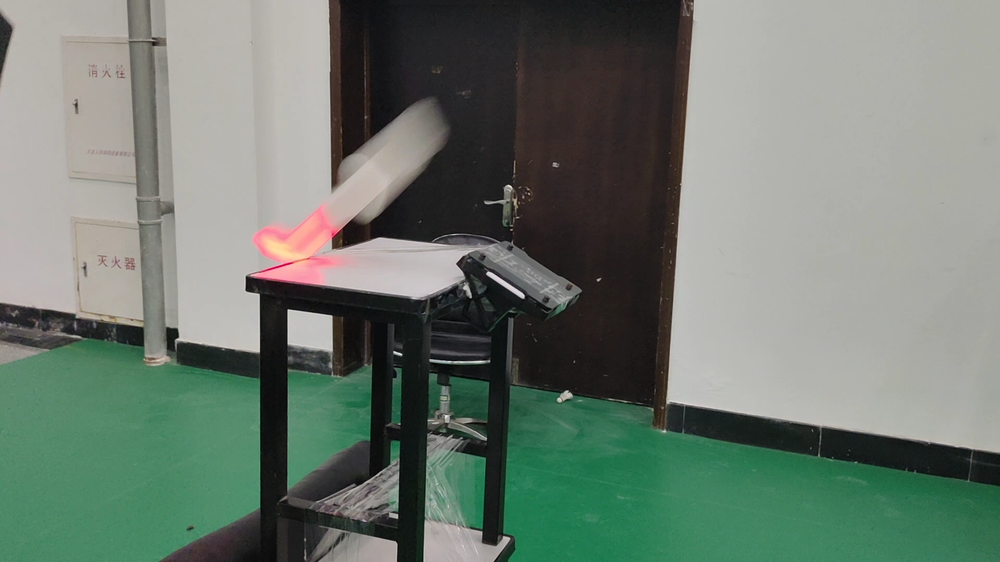
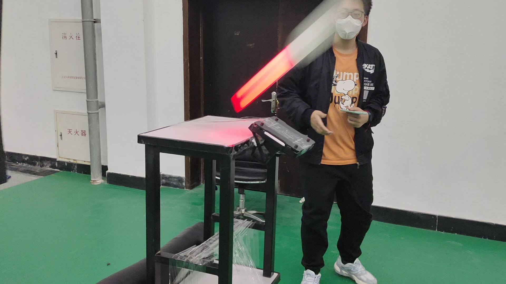
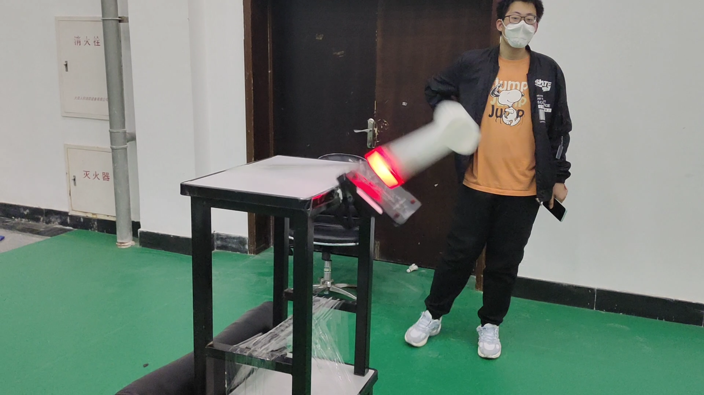

# 飞镖系统测试寄录

## 2023-5-2

### 测试前的修改内容

- 增加额外的pitch和roll方向的限位导轮
- 重新挑选振动数据更好的摩擦轮
- 增加磁吸底座
- 消除yaw齿轮齿隙
- 更改pitch铝方装配方式减小装配间隙
- 拆除摩擦轮双端固定轴承

### 测试记录

在经过对指定单一飞镖进行连续发射10次后记录落点数据

飞镖发射架在发射瞬间的响应使用240fps拍摄

<video src="updatelogs.assets/IMG_9056.MOV"></video>

飞镖在弹道中的姿态

<video src="updatelogs.assets/VID_20230502_144433.mp4"></video>

### 总结

- 后续增加镖体自旋速度稳定姿态（降低自旋速度， 因为高转会导致末段自旋动能不足姿态发散）
- 后续更换镖体材料
- 后续镖架增加纵向支撑型材

## 2023-5-7

### 测试前的修改内容

- 修改摩擦轮编码器速度低通滤波参数
- 飞镖修改为TPU材质的仿广城理飞镖
- 为兼容飞镖翼展略微修改镖架输弹碳管固定打印件和摩擦轮固定打印件
- 增高飞镖架把手

### 测试记录

在经过对指定单一飞镖进行连续发射10次后记录落点数据

飞镖架发射瞬间的红点抖动

<video src="updatelogs.assets/QQ视频20230509103541.mp4"></video>

飞镖在弹道中的姿态

<video src="updatelogs.assets/5FAC98E3E07F1F0252A80ECA0C74D347.MP4"></video>

### 总结

- 摩擦轮的装配方式对于抑制振动至关重要（每颗螺丝需使用同一扭矩拧紧）
- 飞镖弹道相较之前一致性大幅提高， 在弹道中几乎没有姿态发散， 尤其在yaw方向上
- 摩擦轮转速需大幅拉高才能达到和之前pla镖一致的射程7450→8000rpm
- 25m射程需约8700rpm（需要换用更硬更不易开胶的摩擦轮）
- 后续可进行飞镖在不同射程所需摩擦轮转速的标定
- 后续增加飞镖发射初速的观测方式用于修正弹道模型

## 2023-5-13

### 测试前的修改内容

- 更换一对全新摩擦轮（之前拉到9000的高转速动平衡失效）

### 测试记录

进行了一个镖的三连发的打， 图片显示了飞镖随摩擦轮温度上升射程下降

### 总结

- 温度补偿